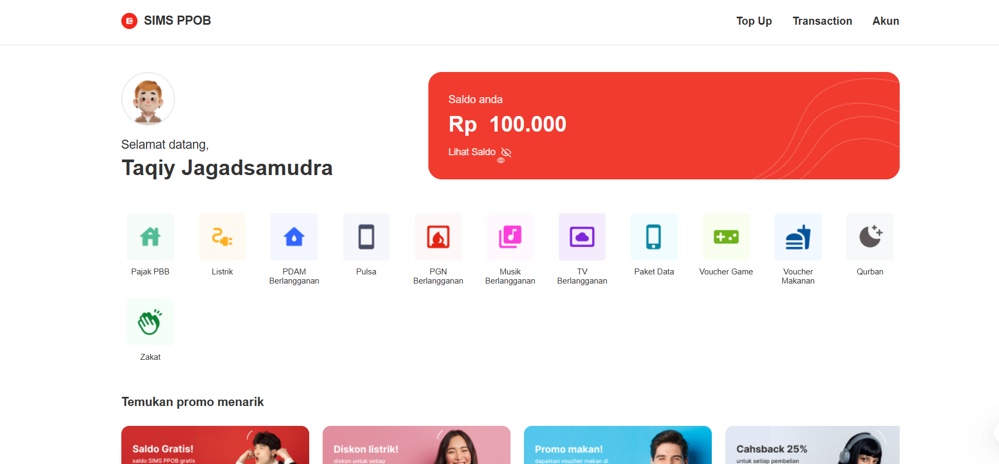

<div align="center">
  
  <h1>SIMS PPOB</h1>
  <p>
    <strong>SIMS PPOB - Taqiy Rizqi Jagad Samudra</strong>
  </p>
  
  <p>
    <a href="https://github.com/RizqiJagad/sims-ppob/LICENSE">
      
    </a>
    
    
    
     
  </p>

  <p>
    <a href="#fitur-utama">Fitur Utama</a> •
    <a href="#tampilan-aplikasi">Tampilan</a> •
    <a href="#teknologi">Teknologi</a> •
    <a href="#instalasi">Instalasi</a> •
    <a href="#gitflow">GitFlow</a>
  </p>
</div>

<br />

> **SIMS PPOB** adalah solusi berbasis web untuk transaksi pembayaran digital yang terintegrasi langsung dengan API Nutech Integrasi. Dibangun dengan fokus pada *User Experience* premium, performa tinggi, dan struktur kode yang modular.

---

## ✨ Fitur Utama

<table>
  <tr>
    <td width="50%">
      <h3>🔐 Membership & Keamanan</h3>
      <ul>
        <li>Registrasi akun baru & Login aman dengan JWT.</li>
        <li>Manajemen Profil (Update data diri & Foto Profil).</li>
        <li>Validasi input visual & notifikasi informatif.</li>
      </ul>
    </td>
    <td width="50%">
      <h3>💳 Transaksi & Layanan</h3>
      <ul>
        <li>Top Up Saldo dengan nominal preset (10k - 250k).</li>
        <li>Pembayaran Tagihan (Listrik, Pulsa, PDAM, dll).</li>
        <li>Riwayat Transaksi detil dengan pagination.</li>
      </ul>
    </td>
  </tr>
     <tr>
    <td colspan="2">
      <h3>📊 Dashboard Interaktif</h3>
      <ul>
        <li>Widget Saldo dengan privasi (Show/Hide).</li>
        <li>Slider Banner Promosi dinamis.</li>
        <li>Grid Layanan responsif.</li>
      </ul>
    </td>
  </tr>
</table>

<br />

## 📸 Tampilan Aplikasi

<div align="center">
  
  <p><em>Dashboard Utama - Ringkas, Modern, Informatif</em></p>
</div>

<br />

## 🛠 Teknologi

Project ini dibangun menggunakan stack modern untuk menjamin performa dan kemudahan pengembangan:

| Kategori | Teknologi | Deskripsi |
| :--- | :--- | :--- |
| **Core** |  | Library UI Utama versi 18 |
| **Build Tool** |  | Bundler super cepat |
| **State** |  | Manajemen State Global (Auth, Transaction) |
| **Styling** |  | Vanilla CSS dengan Custom Properties |
| **Network** |  | HTTP Client dengan Interceptors |
| **Testing** |  | Unit & Component Testing framework |

<br />

## 🚀 Instalasi & Menjalankan

Ikuti langkah berikut untuk menjalankan proyek di komputer lokal Anda:

### Prasyarat
- **Node.js** (v18+)
- **NPM** atau **Yarn**

### Langkah-langkah

1. **Clone Repositori**
   ```bash
   git clone https://github.com/RizqiJagad/sims-ppob.git
   cd sims-ppob
   ```

2. **Instal Dependensi**
   ```bash
   npm install
   ```

3. **Jalankan Mode Pengembangan**
   ```bash
   npm run dev
   ```
   Akses aplikasi di `http://localhost:5173`

4. **Build untuk Produksi & Linting**
   ```bash
   npm run build
   npm run lint
   ```

5. **Menjalankan Test**
    ```bash
    npm run test
    ```

<br />

## 🌿 GitFlow Structure

Kami menerapkan **GitFlow Architecture** yang disiplin untuk menjaga stabilitas kode:

- **`main`**: Branch produksi yang stabil (Protected).
- **`develop`**: Branch utama integrasi sebelum rilis.
- **`feature/*`**: Branch untuk pengembangan fitur spesifik (e.g., `feature/transaction`).

<br />

---

<div align="center">
  <p>Dikembangkan dengan ❤️ oleh <strong>Rizqi Jagad</strong></p>
  <p><em>Take Home Test Implementation Project</em></p>
</div>
